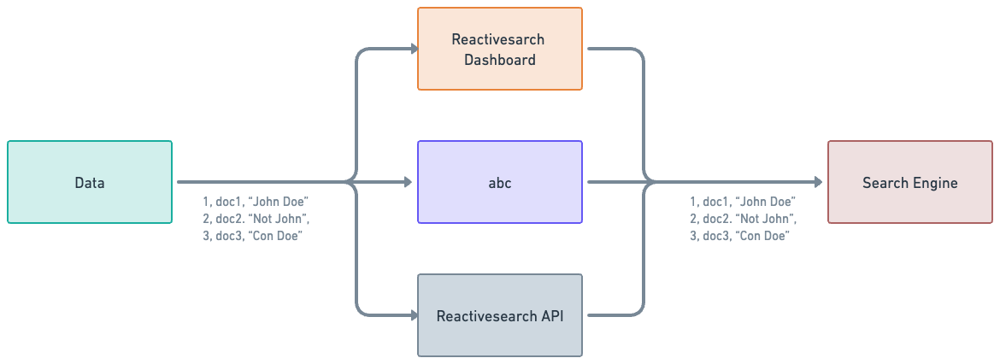

Indexing data into ReactiveSearch is probably the first step in order to start using AI Answer. This doc will explain various ways to index data into ReactiveSearch in a efficient and simple way and get started with AI Answer right away.

## Ways to index

ReactiveSearch supports multiple ways to index data. On it's core, ReactiveSearch sits on top of a search engine and all search engines support indexing. For this example, we will use `OpenSearch`.

## Indexing with vectors

In this indexing, vectors are generated from the data that is passed and stored along with the normal text data. These vectors can be thought of as arrays that contain various details about the input data (the text data in this case). The vectors can be used during the query (search) phase in order to get search results that are more relative.

Vector data is required for types of searching like kNN based searching. The searching supported by all search engines, by default, is text based search. However, this text based search has it's cons as well. This is where kNN search (or vector search) comes in and steals the show. If used properly (if the vectors are generated properly and can contain significant data), then kNN search results are usually much more relevant to the search query.

However, storing the data with kNN requires some extra steps while setting up the index as well as while indexing.

### Indexing without kNN vectors

This is just a normal indexing of data. This can be thought of as taking the raw data and storing it in the search engine's database without any extra steps (like vector fetching). This is the simplest way to index and does not require any extra steps while indexing.

---

AI Answer can work with both kNN based search as well as text based search and is independent of what type of search is used. AI Answer can be thought of as an extra layer on top of search.

## Indexing without vector data

There are multiple ways to index data without storing vector data and as explained before, this is a very simple and straightforward task.

## Indexing with vector data

As explained above, while indexing with vector data, a vector representation of certain fields are generated and stored. These vector representation can be later on used while searching to get more relatable search results.

