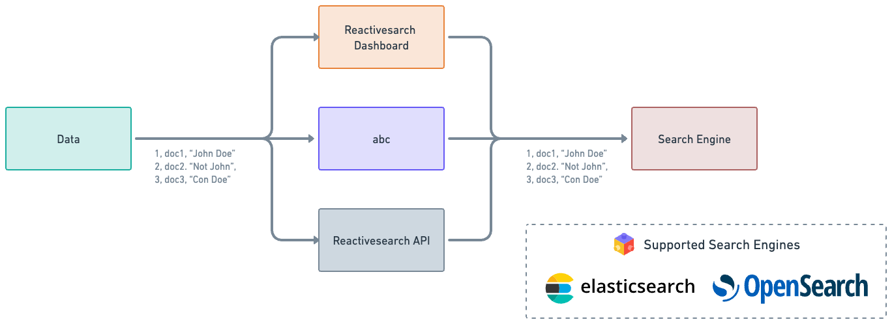

Indexing data into ReactiveSearch is probably the first step in order to start using AI Answer. This doc will explain various ways to index data into ReactiveSearch in a efficient and simple way and get started with AI Answer right away.

## Ways to index

ReactiveSearch supports multiple ways to index data. On it's core, ReactiveSearch sits on top of a search engine and all search engines support indexing. For this example, we will use `OpenSearch`.

### Indexing with vectors

In this indexing, vectors are generated from the data that is passed and stored along with the normal text data. These vectors can be thought of as arrays that contain various details about the input data (the text data in this case). The vectors can be used during the query (search) phase in order to get search results that are more relative.

Vector data is required for types of searching like kNN based searching. The searching supported by all search engines, by default, is text based search. However, this text based search has it's cons as well. This is where kNN search (or vector search) comes in and steals the show. If used properly (if the vectors are generated properly and can contain significant data), then kNN search results are usually much more relevant to the search query.

However, storing the data with kNN requires some extra steps while setting up the index as well as while indexing.

### Indexing without kNN vectors

This is just a normal indexing of data. This can be thought of as taking the raw data and storing it in the search engine's database without any extra steps (like vector fetching). This is the simplest way to index and does not require any extra steps while indexing.

---

AI Answer can work with both kNN based search as well as text based search and is independent of what type of search is used. AI Answer can be thought of as an extra layer on top of search.


## Indexing the data

There are multiple ways to index data without storing vector data and as explained before, this is a very simple and straightforward task.



[Check this doc to get started with indexing the data](https://docs.reactivesearch.io/docs/data/import/)

## Enriching with vector data

As explained above, while indexing with vector data, a vector representation of certain fields are generated and stored. These vector representation can be later on used while searching to get more relatable search results.


### What are vectors

Vectors are representation of features of data in a mathematical way. The vectors are generated based on the passed input by passing it through an AI model. These models are previously trained so that it can find out unique features about the passed data and accordingly return a vector representation.

Let's take a simple example to understand this.

Say we have a simple model which when passed an input, generates a number synonyms for the input and returns it.

For eg:

- `happy` -> [ `joyful`, `delighted` ]
- `contented` -> [ `joyful`, `blissful` ]

Based on the above example, we get the vector representation of the words `happy` and `contented` and we store them as is in the database.

### How are vectors useful?

So from the above example, we used the words `happy` and `contented`. Let's now take this scenario where we have an user that searches this database for `joyful`. When that happens if we do a plain text search, we don't get any matches since we don't have any data that contains the word `joyful`.

However, if we do a vector search, we will find the vector representation of `joyful` and then search that against the older vector representations that we stored. This will lead us to get 2 hits (`happy` and `contented`) even though the search term we used is `joyful`.

This is why vectors are useful.

### How is vector indexing done

In kNN indexing, we follow all the steps of a normal indexing, except there is an extra step just before the data goes for indexing. This step takes a few values from the passed data as input, uses an AI model, and generates the vector embedding of these inputs. These vector embeddings are then injected into the data body and finally it is sent for indexing.

For our use-case, we suggest using ChatGPT for fetching the vector data and using the `ada` model for generating the vector representation of the data.

> NOTE: The model used while indexing the vector data should be the same one that's used while searching the vector data.

### Limitations

As of now, only OpenSearch supports a vector dimension of 1536 which is the dimension of vectors generated by OpenAI's `ada` model. ElasticSearch doesn't support this dimension as of now. Thus, vector data can be stored with OpenSearch only at the moment.

### Vector based indexing

We suggest a simple way to index all the vector data. This is by using a script that we provide. There are two steps in this process:

1. Index the data using the normal way (without vector data)
2. Use our script to automatically inject the vector representation

#### Index the data

This is pretty straightforward. [Refer to the indexing without vector data section](#indexing-without-vector-data) to get started and finish this step. There's nothing more to it other than that.

#### Inject vector representation

We provide a python script that takes care of going through all the data and injecting the vector representation of the data. It also takes care of setting up the appropriate mappings and settings in order to make the index properly store the vector data.

[Check out the script over here](https://github.com/appbaseio/ai-scripts/tree/master/knn_reindex)

To get started with the script, `python3` should be installed.

Once `python3` is installed and available, run the following command and the script will take care of the rest:

```sh
curl -s https://raw.githubusercontent.com/appbaseio/ai-scripts/master/get-ai-script.py --output get-ai.py && python3 get-ai.py knn
```

> NOTE: The above process might take some time to complete depending on the kind of data present in the input index. For example, the script is able to index 500 documents (with vector injected) in 30mins.
