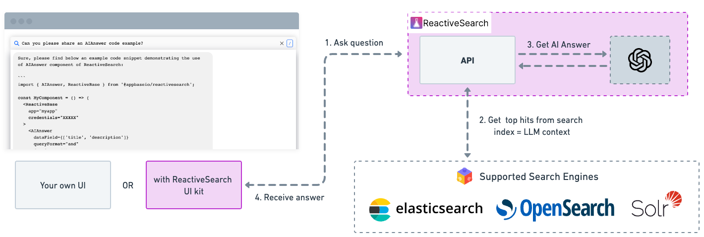

Querying the indexed data with AI Answer can be done in various ways. ReactiveSearch provides various ways to query the data along with various levels of access. ReactiveSearch even provides support for modifying the way the query endpoints behave by using pipelines (more on this later on in this doc).

## Ways to query

From a top-level perspective, there are three main ways to query the data:

- Through ReactiveSearch UI components
- Through ReactiveSearch API
- Through ReactiveSearch Pipelines

## Through UI Components

ReactiveSearch provides a state-of-the art library that uses ReactiveSearch API under the hood and makes development experience much faster. With the UI library, a search UI can be built and brought up within a few minutes.

[Check out this demo to understand more about using AI Answer with ReactiveSearch Components](https://codesandbox.io/s/github/awesome-reactivesearch/q-n-a-search-ui/tree/main/?from-embed)

## Through API

ReactiveSearch API acts as the gateway for accessing the data. It's an easy-to-use API that can be as simple as a search query and get as complex as multiple faceted queries with various query dependencies.

Following is an example ReactiveSearch call that enables the **AI Answer** feature by using the `enableAI` flag in the call. Once the request resolves, the `AISessionId` can be then used to fetch the answers, ask follow-up questions, get analytics etc.

<iframe frameborder="1px" width="100%" height="400px" src="https://play.reactivesearch.io/embed/VvDdd6uvjFUYwVSelYQJ"></iframe>

From the above request, find the `AISessionId` and put it in the following embed to fetch the AI Answer response.

<iframe frameborder="1px" width="100%" height="400px" src="https://play.reactivesearch.io/embed/fp5e52TLUckcPSPTEyty"></iframe>

[Learn more about the endpoints ReactiveSearch provides for interacting with AI](https://api.reactivesearch.io/#44009fda-61f7-4d1b-81b5-9f495d3111a3)

## Through pipelines

ReactiveSearch Pipelines pack a lot of features and functionalities that makes it possible to alter the behaviour of the ReactiveSearch call as well as add extra steps in the flow.

[Learn more about using pipelines to get AI Answers with ReactiveSearch](https://docs.reactivesearch.io/docs/pipelines/how-to/ai-answer)
