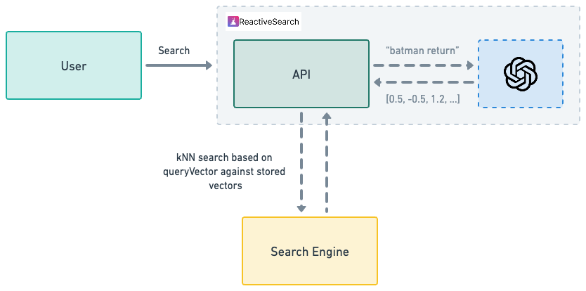

Searching through data is one of the most important features of a search engine. The usual way to search data is text search however in order to get more relevant results, other, more sophisticated methods of searching can be used. One of such methods is kNN based searching.

## What is kNN?

kNN stands for k-Nearest Neighbor where `k` is a variable and while searching it considers `k` neighbors nearby to find relevant results.


kNN is based on the idea of storing vector representation of text (or other types of) data and then searching by passing vectors as well.

This means during indexing, certain fields will have to be used for generating a vector representation. This representation can be thought of as an unique ID that will identify various features of the input fields.

These unique features will be checked against while searching.

Again, while searching, the search query will have to be converted into vector representation as well and then an algorithm can be used between the input query vector and all the stored vector data. This is where kNN comes in. kNN is the algorithm that takes care of finding the most relevant search results based on the input vector and the stored vectors.

> NOTE that the model used to convert the text into vector should be the same while indexing and searching.

## Enriching with vector data

> TL;DR: If your data already contains vector representation, you can skip this part and [head to querying](#querying-with-knn)

If you have an indexed dataset that does not have vector representation, ReactiveSearch provides a script to convert that dataset with vector representation.

While indexing with vector data, a vector representation of certain fields are generated and stored. These vector representation can be later on used while searching to get more relatable search results.


### What are vectors

Vectors are representation of features of data in a mathematical way. The vectors are generated based on the passed input by passing it through an AI model. These models are previously trained so that it can find out unique features about the passed data and accordingly return a vector representation.

Let's take a simple example to understand this.

Say we have a simple model which when passed an input, generates a number synonyms for the input and returns it.

For eg:

- `happy` -> [ `joyful`, `delighted` ]
- `contented` -> [ `joyful`, `blissful` ]

Based on the above example, we get the vector representation of the words `happy` and `contented` and we store them as is in the database.

### How are vectors useful?

So from the above example, we used the words `happy` and `contented`. Let's now take this scenario where we have an user that searches this database for `joyful`. When that happens if we do a plain text search, we don't get any matches since we don't have any data that contains the word `joyful`.

However, if we do a vector search, we will find the vector representation of `joyful` and then search that against the older vector representations that we stored. This will lead us to get 2 hits (`happy` and `contented`) even though the search term we used is `joyful`.

This is why vectors are useful.


### How is vector indexing done

In kNN indexing, we follow all the steps of a normal indexing, except there is an extra step just before the data goes for indexing. This step takes a few values from the passed data as input, uses an AI model, and generates the vector embedding of these inputs. These vector embeddings are then injected into the data body and finally it is sent for indexing.

For our use-case, we suggest using ChatGPT for fetching the vector data and using the `ada` model for generating the vector representation of the data.

> NOTE: The model used while indexing the vector data should be the same one that's used while searching the vector data.

### Limitations

As of now, only OpenSearch supports a vector dimension of 1536 which is the dimension of vectors generated by OpenAI's `ada` model. ElasticSearch doesn't support this dimension as of now. Thus, vector data can be stored with OpenSearch only at the moment.

### Vector based indexing

We suggest a simple way to index all the vector data. This is by using a script that we provide. There are two steps in this process:

1. Index the data using the normal way (without vector data)
2. Use our script to automatically inject the vector representation

#### Index the data

This is pretty straightforward. [Refer to the indexing data section](#indexing-the-data) to get started and finish this step. There's nothing more to it other than that.

#### Inject vector representation

We provide a python script that takes care of going through all the data and injecting the vector representation of the data. It also takes care of setting up the appropriate mappings and settings in order to make the index properly store the vector data.


[Check out the script over here](https://github.com/appbaseio/ai-scripts/tree/master/knn_reindex)

To get started with the script, `python3` should be installed.

Once `python3` is installed and available, run the following command and the script will take care of the rest:

```sh
curl -s https://raw.githubusercontent.com/appbaseio/ai-scripts/master/get-ai-script.py --output get-ai.py && python3 get-ai.py knn
```

> NOTE: The above process might take some time to complete depending on the kind of data present in the input index. For example, the script is able to index 1000 documents (with vector injected) in ~1 hour.

## Querying with kNN



ReactiveSearch makes it very easy to query data with kNN. kNN based searching is supported out of the box so a simple query like following will do the job:

```json
{
    "query": [
        {
            "id": "knn",
            "vectorDataField": "vector_data",
            "value": "some movie",
            "queryVector": [0.2, -0.5, 1.2, ...]
        }
    ]
}
```

In the above, two fields are specified and these two fields are essential for vector based searching:

- **vectorDataField**: Field to indicate the dataField where the vector representation is stored.
- **queryVector**: Vector representation of the input query

Though the above is simple enough, generating the `queryVector` is a non-trivial task since it requires hitting an AI model with the input.

This is where ReactiveSearch pipelines can make the job easy. ReactiveSearch pipelines come with pre-built stages that can automatically generate the  `queryVector` from the `value` field and inject it into the query body.

Following is an example stage that does that:

```yaml
- id: fetch embeddings
  use: openAIEmbeddings
  inputs:
    apiKey: "{{openAIApiKey}}"
    useWithReactiveSearchQuery: true
  continueOnError: false
- use: reactivesearchQuery
  needs:
  - fetch embeddings
  continueOnError: false
```

The pre-built stage `openAIEmbeddings` takes care of injecting the `queryVector`.

[Read more about this pipeline and how to use it](../../pipelines/how-to/knn-response-stage)