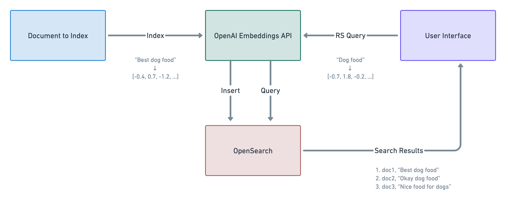

In this guide, we explain how OpenAI can be integrated into ReactiveSearch to take things above and beyond. ReactiveSearch in itself is capable of handling things like indexing data into OpenSearch/ElasticSearch as well as searching data.

Integrating OpenAI with ReactiveSearch adds the functionality to support kNN based searching/indexing on the data thus increasing the accuracy of the search results. In this guide, we will explain how [OpenAI's Embeddings API](https://beta.openai.com/docs/guides/embeddings) is being leveraged to make search better than ever.

## Overview of Workflow

The basic workflow is divided into two sub-flows:

1. Indexing data: In this, we use OpenAI's API to generate vector representation of the input fields and store them as vector data accordingly in order to use them during search.
2. Searching data: In this, we use OpenAI's API to generate vector representation of the search query passed by the user in order to use kNN search against the vector data field.

### Indexing Data

Indexing is done in two steps:

- Use OpenAI's API to get the vector representation of the fields that are to be stored as vector
- Index the data into OpenSearch along with the newly injected vector data field

### Searching Data

Searching the data is done in:

- Use OpenAI's API to get the vector representation of the query value
- Take the resulting vector and send it to OpenSearch/ElasticSearch
- Return the response received from OpenSearch/ElasticSearch back to the user




## Pre-Requisites

Before starting with the process of indexing vector data, some mapping and settings need to be set in OpenSearch.

> NOTE: This example does not work with ElasticSearch as of the date when this doc is written. This is because ElasticSearch caps the length of the vector field at 1024 whereas OpenAI's embeddings are of length 1536.

The settings for the index will have to be specified when the index is created. This can be done in the following way. Below the vector field is named as `vector_data` and the name of the index is set as `amazon_reviews`.

```
PUT /{index}

{
    "settings": {
        "knn": true,
        "knn.algo_param.ef_search": 100
    },
    "mappings": {
        "properties": {
            "vector_data": {
                "type": "knn_vector",
                "dimension": 1536,
                "method": {
                    "name": "hnsw",
                    "space_type": "cosinesimil",
                    "engine": "nmslib"
                }
            }
        }
    }
}
```

### kNN plugin for OpenSearch

The above settings will be accepted only if the `opensearch-knn` plugin is installed in the OpenSearch instance that gets the above request. This plugin is shipped by default for the complete versions of OpenSearch, however the minimal versions doesn't include the plugin. In such a case, it can be installed by the following command:

```sh
./bin/opensearch-plugin install --batch https://repo1.maven.org/maven2/org/opensearch/plugin/opensearch-knn/$OS_VERSION.0/opensearch-knn-$OS_VERSION.0.zip
```

> NOTE: Above might need `sudo` in order to execute properly

## Using OpenAI Embeddings

OpenAI API requires an API key in order to access the API. This API key can be generated by signing up at https://platform.openai.com/signup. Once signed up, click on `Personal` on the top right corner and click `View API keys`.

This API key will have to be passed to the pipeline so that it can use the API properly in order to get the data embeddings.

## Indexing Setup

In order to start indexing the data with ReactiveSearch while using OpenAI, a pipeline needs to be setup. This pipeline will basically have an extra step that will take care of fetching the embeddings and injecting them into the request body.

> TL;DR: The complete indexing pipeline can be found [here](https://docs.reactivesearch.io/docs/pipelines/how-to/knn-indexing). In order to setup this pipeline in one-click, [this link can be used](https://dashboard.reactivesearch.io/deploy?template=https://raw.githubusercontent.com/appbaseio/pipelines-template/master/openai_indexing/pipeline_oneclick.yaml).

The pipeline will consist of a few pre-built stages provided by ReactiveSearch. These are:

1. authorization
2. openAIEmbeddingsIndex
3. elasticsearchQuery

### Initial pipeline definition

Before starting with the stage definitions for the pipeline, the basic details like routes etc need to be defined. It can be done in the following way:

```yaml
enabled: true
description: Index pipeline to store vectorized data

routes:
  - path: /amazon_reviews/_doc
    method: POST
    classify:
      category: elasticsearch
      acl: index

envs:
  openAIApiKey: <your-api-key>
  method: POST
```

In the above, a new route `/amazon_reviews/_doc` is added for the method `POST`. The pipeline will be invoked if the above route is matched. The OpenAI API's APIKey is also added as an env variable so that it can be used in a later stage. This should be the value of the api key that was explained in a previous step.

### Authorization

This stage is pretty self-explanatory. As the name suggests, this makes sure that the request is authorized in order for it to continue to the next stage in the pipeline. This is a must-have for any pipeline defined by users.

The is a `pre-built` stage provided by ReactiveSearch and can be leveraged in the following way:

```yaml
- id: "authorize user"
  use: "authorization"
```

### openAIEmbeddingsIndex

Now that we have authorized the user that's making the request, we can fetch the embeddings for the request body passed and update the body with the embeddings. This can be simply done by using the pre-built stage `openAIEmbeddingsIndex`.

```yaml
- id: fetch embeddings
  use: openAIEmbeddingsIndex
  inputs:
    apiKey: "{{openAIApiKey}}"
    inputKeys:
    - Summary
    - Text
    outputKey: vector_data
  continueOnError: false
```

This is a stage provided by ReactiveSearch for OpenAI specific usage. It's very easy to use and takes care of reading from the request body, getting the embeddings using OpenAI API and updating the request body accordingly.

[Read more about this stage here]()

In the above stage, we are passing the `apiKey` input by reading it dynamically from the envs that are defined in the top of the pipeline.

Besides that there are two more inputs specified.

`inputKeys` is the input that indicates which keys from the request body should be used to fetch the embeddings for. In our example and as stated above, we will use the `Summary` and `Text` key and thus the `inputKeys` array contains those two. These two keys will be extracted and joined using a comma `,` and then passed to OpenAI API in order to get the vector embedding for them.

`outputKey` indicates the key where the output will be written. In simple words, this is the key that will be injected in the request body with the vector data that was fetched from OpenAI.

In this example, it is set to `vector_data` since in the mappings we have defined the vector field as `vector_data`. This can be found in the [Pre Setups](#pre-setups) section of this how-to doc.

### elasticsearchQuery

Now that we have the vector data ready and merged in the request body, we can send the index request to OpenSearch. This can be done by using the pre-built stage `elasticsearchQuery`.

```yaml
- id: index data
  use: elasticsearchQuery
  needs:
    - fetch embeddings
```

The complete pipeline can be deployed by [using this link](https://dashboard.reactivesearch.io/deploy?template=https://raw.githubusercontent.com/appbaseio/pipelines-template/master/openai_indexing/pipeline_oneclick.yaml)

### Utility Script

In order to make it easier to index the data into OpenSearch, we have provided an utility script that can be run once to index all the data from the desired dataset. [Read more about this utility script here](https://github.com/appbaseio-apps/knn-search-ui/blob/master/backend/index/util)

## Query Pipeline

Querying the vector data is another aspect of ReactiveSearch that can be done easily using OpenAI. For this as well, a pipeline will be required to be created. This pipeline will have a custom stage that will take care of injecting the request body with the vector representation of the query sent by the user.

> TL;DR: The complete query pipeline can be found [here](https://docs.reactivesearch.io/docs/pipelines/how-to/knn-response-stage). In order to setup this pipeline in one-click, [this link can be used](https://dashboard.reactivesearch.io/deploy?template=https://raw.githubusercontent.com/appbaseio/pipelines-template/master/openai_search/pipeline_oneclick.yaml).

Following pre-built stages will be used in the query pipeline:

1. authorization
2. openAIEmbeddings
3. reactivesearchQuery
4. elasticsearchQuery

### Initial pipeline definition

Before starting with the stage definitions for the pipeline, the basic details like routes etc need to be defined. It can be done in the following way:

```yaml
enabled: true
routes:
- path: "/amazon_reviews/_reactivesearch"
  method: POST
  classify:
    category: reactivesearch

envs:
  openAIApiKey: <your-api-key>

```

The route defined here is `/amazon_reviews/_reactivesearch` and the method is `POST`. An env variable is defined so that the OpenAI API key can be passed to the stage that needs to use it.

### Authorization

Similar to the indexing pipeline, the authorization stage takes care of making sure that the request is authorized before going forward to the next stage.

The is a `pre-built` stage provided by ReactiveSearch and can be leveraged in the following way:

```yaml
- id: authorize user
  use: authorization
```

### openAIEmbeddings

Fetch the embeddings for the passed query. In order to achieve this, we can use the `openAIEmbeddings` pre-built stage that takes care of fetching the vector representation of the query and injecting the representation into the request body directly.

```yaml
- id: fetch embeddings
  use: openAIEmbeddings
  inputs:
    apiKey: "{{openAIApiKey}}"
    useWithReactiveSearchQuery: true
  continueOnError: false
```

In the above, we are passing the `openAIApiKey` as input since that's a required value in order for the stage to work properly. Besides that, the `useWithReactiveSearchQuery` field is passed as `true`. This field triggers the stage to iterate over the request body which is a ReactiveSearch Query body and finds out all the queries that have the `vectorDataField` field set. Whichever queries has this field set, the stage will extract the `value` passed in that query and generate the embedding for it using OpenAI's API. Once the embedding is generated, it is injected into the `queryVector` field of the same query so that it can be utilized in the next stage.

> NOTE that if `value` is not preferred for the vector embedding, a static value can be passed through inputs to this stage by specifying the value in the `text` field.

### reactivesearchQuery

Now, we can use the pre-built stage `reactivesearchQuery` to convert the ReactiveSearch query into ElasticSearch query in order to find the search results.

We can do that in the following way:

```yaml
- id: reactivesearch
  use: reactivesearchQuery
  needs:
    - fetch embeddings
  continueOnError: false
```

### elasticsearchQuery

The final stage is to hit ElasticSearch with the translated query and get the response. This can be done by using the pre-built stage `elasticsearchQuery`

This stage can be defined in the following way:

```yaml
- id: elastic search
  use: elasticsearchQuery
  continueOnError: false
```

The complete pipeline can be deployed by [using this link](https://dashboard.reactivesearch.io/deploy?template=https://raw.githubusercontent.com/appbaseio/pipelines-template/master/openai_search/pipeline_oneclick.yaml)


## Querying the Data

Now that both the data is indexed and the query pipeline is created, the data needs to be searched and verified. This can be done by hitting the `_reactivesearch` endpoint defined in the pipeline with a `POST` method.

Following playground URL shows that in an intuitive way.

<iframe src=https://play.reactivesearch.io/embed/32Xox0q4osvXOSQTyj8A     style="width:100%; height:500px; border:0; border-radius: 4px; overflow:hidden;"     title=rs-playground-32Xox0q4osvXOSQTyj8A   ></iframe>
